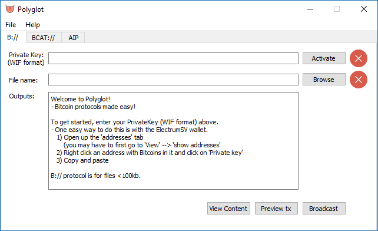
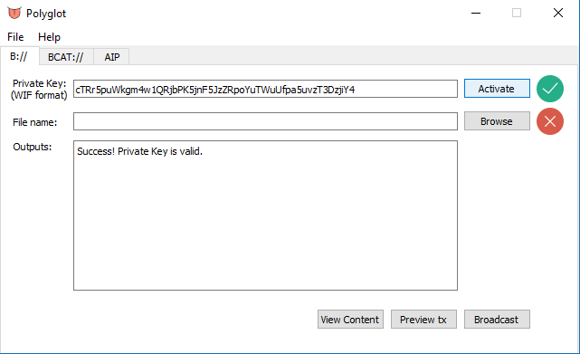
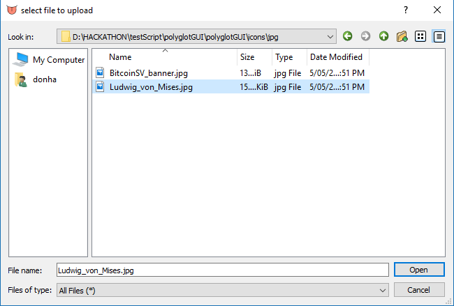
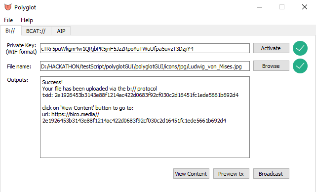

Polyglot: Bitcoin protocols made easy
=====================================
Documentation: https://austecon.github.io/polyglot/
Powered by BitSV: https://github.com/AustEcon/bitsv
Powered by Polyglot https://github.com/AustEcon/polyglot

Polyglot Mission
----------------

Is to lower barriers to entry for everybody and make metanet FUN!

* Is it just going to be for uploading files?

    - No I have much bigger plans for this.
    - This library is designed to be the easiest way for anybody to interface with all of the various, growing bitcoin metanet protocols.

    Data Carriage:

    - B:// (for multimedia up to 100kb) - https://github.com/unwriter/B
    - BCAT:// (for multimedia up to 310mb uncompressed, 110GB with nested gzip) - https://bcat.bico.media/

    Endpoint managers for html and web development:

    - bottle browser (https://bottle.bitdb.network/) (native metanet) browser and urls for mainstream browsers / 3rd party servers:

        - B:// (ref. by txid)
        - C:// (ref. by sha256 hash of content)
        - D:// (ref. by dynamic state - linked to identity system)

    Identity Systems:

    - AIP (https://github.com/BitcoinFiles/AUTHOR_IDENTITY_PROTOCOL)
    - other identity protocols (e.g. Ryan X. Charles of Money Button will be announcing one at CoinGeek)

    Other protocols

    - MAP protocol for linking all kinds of different protocols together (powerful)
    - A.N.N.E. protocol by Mr Scatmann - https://medium.com/@bsmith12251960/a-n-n-e-the-alpha-testing-begins-545f809c6129 (eagerly awaited)

What works
-----------
- Installation instructions on Linux and Windows 10
- B:// protocol uploading tab works but please bear in mind that it will consolidate all of your utxos! (fixed in https://github.com/AustEcon/polyglot prior to hackathon deadline - but this GUI has one of the older copies)

What needs fixing
-----------------
- A "polyglot engine" transplant" from the other repo at https://github.com/AustEcon/polyglot to:

    - Prevent utxo consolidation on uploading
    - Get bcat protocol working

----------------------------

Examples
--------

See the uploaded image at https://bico.media/2e1926453b3143e88f1214ac422d0683f92cf030c2d16451fc1ede5661b692d4

Features (Planned)
------------------

- B:// (for multimedia up to 100kb) - https://github.com/unwriter/B
- BCAT:// (for multimedia up to 310mb uncompressed, 110GB with nested gzip) - https://bcat.bico.media/
- Bottle (https://bottle.bitdb.network/) (native metanet) refs and mainstream urls for:

    - B:// (ref. by txid)
    - C:// (ref. by sha256 hash of content)
    - D:// (ref. by dynamic state - linked to identity system)

- AIP (https://github.com/BitcoinFiles/AUTHOR_IDENTITY_PROTOCOL)
- other ID protocols (e.g. Ryan X. Charles of Money Button has been working hard on this area)
- MAP protocol for linking all kinds of different protocols together (powerful)
- A.N.N.E. protocol by Mr Scatmann - https://medium.com/@bsmith12251960/a-n-n-e-the-alpha-testing-begins-545f809c6129

Installation
------------

I intend to make this into a .exe but pyinstaller is giving me grief under such time pressure! - but for the purposes of this CoinGeek Hackathon...

On Windows:

1) install the latest python3 and make sure you tick the box to install pip and add python to system path.
2) install git for windows https://gitforwindows.org/
3) open up a directory that you want to download this repository to and:

.. code-block:: bash

    $ git clone https://github.com/AustEcon/polyglotGUI.git

4) install virtualenv for python (optional) and create a virtualenv "my_env".
Then "activate" the virtual environment (don't change directories in-between steps 3 and 4)

.. code-block:: powershell

    > pip install virtualenv
    > python.exe -m virtualenv my_env
    > .\my_env\Scripts\activate

5) use pip to install requirements; then run the application

.. code-block:: powershell

    > pip install -r .\polyglotGUI\requirements.txt
    > python.exe .\polyglotGUI\polyglotGUI\polyglot_GUI.py

You can now simply double-click on the polyglot_GUI.py icon and it will run

A powershell script is included "install.ps1" if you right-click and run this it performs steps 4 and 5 for you.

On Linux / Ubuntu (very similar)

1) clone this repository

.. code-block:: bash

    $ git clone https://github.com/AustEcon/polyglotGUI.git

2) install virtualenv (I will leave that task to you) then create a python3 virtualenv

.. code-block:: bash

    $ virtualenv -p /user/bin/python3 venv

3) Change directory

.. code-block:: bash

    $ source venv/bin/activate
    (venv) $ pip install -r requirements.txt

4) Run the application with python3

.. code-block:: bash

    (venv) $ python3 polyglotGUI/polyglotGUI/polyglot_GUI.py

Documentation
-------------
coming...

Credits
-------
- CoinGeek for hosting an awesome Hackathon

Donate
--------
- Made by $AustEcon (Handcash handle)
